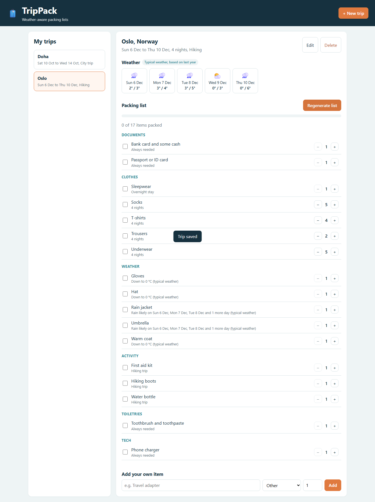

# TripPack

TripPack is a web application that builds a packing list from the weather at your destination, the length of your trip and the type of trip. You enter where you are going, the dates and whether it is a city trip, a beach holiday, a hiking trip or a business trip. TripPack loads the weather and suggests what to pack, with a reason for every item. You tick items off while packing and add your own items.

Project for the course **Project: Java and Web Development (DLBCSPJWD01)** at IU International University. Author: Muhammad Moiz.



## Features

- Create, edit and delete trips. The destination field suggests places as you type.
- Weather for every day of the trip. Trips within the next 16 days use the real forecast. Trips further away use the weather of the same dates last year, shown as "typical weather".
- Packing list generated by rules, grouped by category, with the reason for each item, for example "Rain likely on Sun 6 Dec".
- Tick items as packed, change quantities, add and remove your own items, and see your progress.
- Responsive layout for desktop, tablet and phone.

## Requirements

- **Java 17 or newer** (JDK). Check with `java -version`.
- An internet connection, because the weather comes from the free [Open-Meteo](https://open-meteo.com) API. **No API key or account is needed.**

Nothing else needs to be installed. Maven is included through the Maven wrapper and the database (H2) is embedded.

## Install and run

```bash
git clone https://github.com/muhammadmoiz65/trippack.git
cd trippack

# Windows
mvnw.cmd spring-boot:run

# macOS / Linux
./mvnw spring-boot:run
```

Then open **http://localhost:8080** in your browser.

The first start takes a few minutes because Maven downloads the libraries. Trips are saved in the folder `data/` and are still there after a restart. To start with an empty app, stop it and delete the `data/` folder.

To build a single runnable file instead:

```bash
./mvnw package
java -jar target/trippack-0.0.1-SNAPSHOT.jar
```

## Run the tests

```bash
./mvnw test
```

There are 25 automated tests. They do not need the internet, because the weather API is replaced by test data.

| Test class | What it checks |
|---|---|
| `PackingRuleEngineTest` | All packing rules: quantities per night, the laundry limit for long trips, rain, cold, cool, heat, snow, wind, each trip type, missing weather |
| `WeatherServiceTest` | Forecast or typical weather depending on the dates, moving last year's dates to this year, no crash when the weather API fails |
| `WeatherClientTest` | Converting the Open-Meteo response into one object per day, rain thresholds, missing values |
| `TripApiIntegrationTest` | The REST API with the whole application and an in-memory database: place search, validation errors, 404, and the full flow of creating a trip, generating the list, ticking, adding, regenerating and deleting |

`tools/ui_check.py` is an extra end-to-end check in a real browser (Python and Playwright, optional). It also creates the screenshots in `docs/screenshots/`.

## Technology

| Part | Technology | Why |
|---|---|---|
| Front-end | HTML, CSS, JavaScript (no framework) | Runs in every browser, no build step. `fetch` talks to the back-end. CSS Grid and media queries for the responsive layout |
| Back-end | Java 17, Spring Boot 4 (Spring Web MVC, Spring Data JPA, Bean Validation) | Widely used, clear layers: controller, service, repository |
| Database | H2, embedded, stored in a file | Nothing to install, data survives restarts |
| External API | Open-Meteo geocoding, forecast and historical weather | Free, no key. Only the back-end calls it and turns the result into a simpler format |
| Tests | JUnit 5, AssertJ, Mockito, Spring MockMvc | Unit tests for the rules, integration tests for the API |

## Architecture

```
Browser (index.html, app.js, styles.css)
   |  JSON over HTTP
   v
Spring Boot back-end
   controllers   TripController, ItemController, PlaceController
   services      TripService, PackingService, WeatherService
   rules         PackingRuleEngine
   client        WeatherClient  ---->  Open-Meteo APIs
   repositories  TripRepository, PackingItemRepository  ---->  H2 database
```

The weather of a trip is loaded once and then stored with the trip, so the external API is not called every time a trip is opened.

## REST API

| Method | Path | Purpose |
|---|---|---|
| GET | `/api/places?q=Doha` | Search destinations |
| GET | `/api/trips` | List all trips |
| POST | `/api/trips` | Create a trip |
| GET | `/api/trips/{id}` | One trip |
| PUT | `/api/trips/{id}` | Change a trip |
| DELETE | `/api/trips/{id}` | Delete a trip and its list |
| GET | `/api/trips/{id}/weather` | Weather of the trip (`?refresh=true` loads it again) |
| POST | `/api/trips/{id}/list/generate` | Build the packing list. Own items are kept |
| GET | `/api/trips/{id}/items` | The packing list |
| POST | `/api/trips/{id}/items` | Add an own item |
| PATCH | `/api/trips/{id}/items/{itemId}` | Tick an item or change its quantity |
| DELETE | `/api/trips/{id}/items/{itemId}` | Remove an item |

Errors are returned as JSON with a `detail` message, for example when the end date is before the start date.

## Project structure

```
src/main/java/com/trippack/
  trip/      Trip entity, TripService, TripController
  packing/   PackingItem entity, PackingRuleEngine, PackingService, ItemController
  weather/   WeatherClient (Open-Meteo), WeatherService, PlaceController
src/main/resources/
  static/    index.html, app.js, styles.css
  application.properties
src/test/java/com/trippack/   unit and integration tests
docs/screenshots/             screenshots of the app
```
